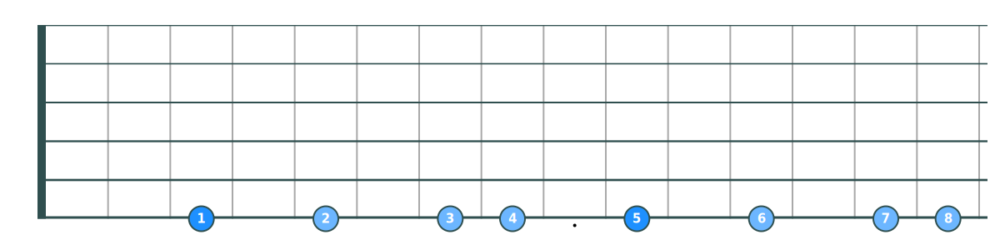
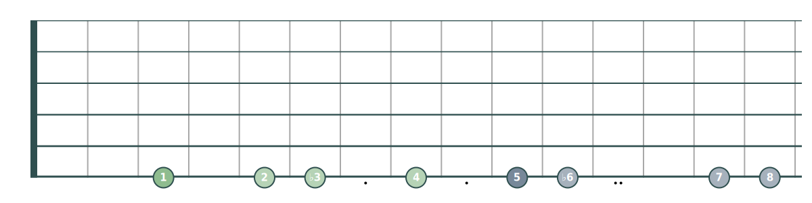
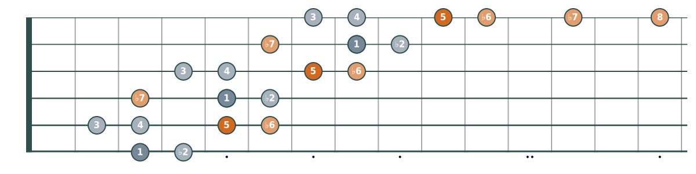

# Tetrachord scales on the guitar

Recently, while listening to a talk on standard guitar tuning, I was introduced to
the concept of tetrachords as a way of navigating the guitar fretboard. This was
a fascinating conceptual shift which motivated me to explore further the
application of tetrachords to scales on the guitar neck. I had always wanted to
expand my scale knowledge and this was a method that gels well with systems software
thinking, being grounded in composability, abstraction and symmetry.

The goal of the text below is to derive 3-octave guitar scales from
[tetrachords](https://en.wikipedia.org/wiki/Tetrachord). Tetrachords are
4-note scale fragments spanning a perfect fourth interval. Viewing the guitar
fretboard through this lens appears to confer a number of advantages, including:
* *Building scales from music theory fundamentals*. Other methods for deriving
  scales start with learned patterns such as CAGED, 3NPS, etc. In cases such as CAGED,
  there is an organizing principle, namely the respective chord shapes, below we
  build directly on the scale definitions. All scale memorization is based
  around awareness of key anchor ports on the fretboard, the perfect intervals
  `[1, 4, 5, 8]`.
* *Composability*. 7-note scales are built out of pairs of tetrachords, of which only a
  handful are commonly needed. Tetrachord building blocks are snapped together to form scales like
  Lego or Tetris pieces.
* *Scalability*. Knowing 5 tetrachords gives 25 derived 7-note scales. Learning
  scales sub-linearly, `O(sqrt(N))` with
  the number of scales. This advantage is tempered by the limited number of
  scales and modes that are contextually relevant.
* *Minimizing rote memorization*. It's not even necessary to remember that a major
  scale consists of the WWHWWWH intervals. Instead, only the (shorter) major
  tetrachord intervals WWH needs to be remembered and the fact that a major scale
  consists of two concatenated major tetrachords. The tetrachord names used below
  also assist here, acting as a mnemonic device for their associated scales.
* *Range*. The entire fretboard and guitar range can be covered with reusable patterns.
* *Improvisation*. Tetrachords can be used as an organizing principle for
  [improvisation](https://blog.truefire.com/guitar-lessons/learn-how-to-improvise-intervals-tetrachords/). Tetrachord intervals can imply [[1]](https://youtu.be/-3oo45vpQV4?t=844)[[2]](https://youtu.be/mQDEYda1-xQ?t=284) tendencies in melodic movement.

The derived scales below follow logically from tetrachord definitions. While
some efficiency considerations are made, e.g. reducing position shifts with the left hand and awkward
stretches, these scale patterns are not always optimal for playability. As an
early intermediate-level guitar player, my own experience so far is that the
win from tetrachordal thinking on the guitar is having a consistent and efficient
method for understanding music theory on the fretboard.

All diagrams below are generated via a [Python script](scales/), which provides
an executable specification of the tetrachords and scales.

## Tetrachord definitions

Tetrachords can be defined as 4-note scale fragments covering a perfect
fourth interval, e.g. the intervals 1 ♭2 ♭3 4. A helpful introduction to the
history and function of tetrachords can be found
[here](https://youtu.be/-3oo45vpQV4).

### Example &mdash; the major and melodic minor scales

The major tetrachord consists of the whole/half steps WWH, covering the
intervals 1 2 3 4. If another major tetrachord is concatenated to this sequence
with a whole step between the two major tetrachords, we end up with the diatonic
major scale. This can be visualized as the steps **WWH**-W-**WWH**, where the bold
sequences are major tetrachords. Note the symmetry and that the tritone
between the P4 and P5 intervals acts as a mid-point.

In general, scales have the form **lower tetrachord**-W-**upper tetrachord**.

On the guitar fretboard, when applied as a single-string scale starting on low
G, the major scale is:

In the diagrams above and below, each type of tetrachord has a distinct color
and a slightly darker note indicates the beginning of the tetrachord.

Another example is the melodic minor scale, where the minor tetrachord WHW is
combined with the major tetrachord as **minor tetrachord**-W-**major
tetrachord** to give the steps **WHW**-W-**WWH**:

### Tetrachord building blocks

Rather than use whole/half step notation, e.g. WWH, we switch to half-steps
below, e.g. 221. Halfstep notation supports larger intervals, e.g. 131.

We now introduce 4 tetrachords. The terminology is similar to that used
[here](https://en.wikipedia.org/wiki/Tetrachord#Romantic_era)
, except instead of "upper minor" the name "Phrygian" is used. The rationale for
this is that by associating names of tetrachords with scales they typify, they
are somewhat easier to learn and remember. Names are helpful in learning scales,
for example a Phrygian scale is two concatenated Phrygian tetrachords, the
harmonic minor scale is a harmonic tetrachord concatenated to a minor
tetrachord.

| Tetrachord  | Halfsteps | Intervals as lower tetrachord | Intervals as upper tetrachord |
| -------- | ----- | ------- | ------- |
| Major    | 2 2 1 | 1 2 3 4 | 5 6 7 8 |
| Minor    | 2 1 2 | 1 2 ♭3 4 | 5 6 ♭7 8 |
| Harmonic | 1 3 1 | 1 ♭2 3 4 | 5 ♭6 7 8 |
| Phrygian | 1 2 2 | 1 ♭2 ♭3 4 | 5 ♭6 ♭7 8 |

Each tetrachord can be split across two strings of the guitar as 4 [distinct
shapes](https://www.notreble.com/buzz/2010/03/18/lesson-scale-patterns-from-tetrachord-combinations/), which are cataloged below for each tetrachord. Due to the similarity to
Tetris pieces, they are named with [tetromino](https://en.wikipedia.org/wiki/Tetromino)-like terminology.

It may appear there is a lot to remember (16 distinct patterns) and commit to
muscle memory. However, in practice it is only necessary to know:
* The I-shape, the defining intervals of the tetrachord.
* Some combination of Z-shape and J-shape, depending on scale and how optimized
  for playability scales need to be (discussed more below). J-shapes that span
  5 frets involve larger stretches or shifts, so might be less preferable.

The R-shape is simply a truncated I-shape, where fretboard topology gives the
fact that the P4 will always be directly below the P1 (or the P8 directly below the P5). Muscle
memory for the I-shape should apply to the R-shape. The same should be true for the
J-shape, acting as a suffix for the I-shape on the second string, but this seems
anecdotally harder to capture through muscle memory.

#### Major tetrachord shapes

| I-major  | R-major | Z-major | J-major |
| -- | -- | -- | -- |
|  |  |  |  |

#### Minor tetrachord shapes

| I-minor  | R-minor | Z-minor | J-minor |
| -- | -- | -- | -- |
|  |  |  |  |

#### Harmonic tetrachord shapes

| I-harmonic  | R-harmonic | Z-harmonic | J-harmonic |
| -- | -- | -- | -- |
|  |  |  |  |

#### Phrygian tetrachord shapes

| I-Phrygian  | R-Phrygian | Z-Phrygian | J-Phrygian |
| -- | -- | -- | -- |
|  |  |  |  |

## Deriving scales from tetrachords

A selection of scales built from the 4 tetrachords above are provided in the table
below. There are others that can be derived from these tetrachords that are not
listed, e.g. harmonic major.

The only thing in this table that requires commitment to memory is the mapping
from scale name to lower and upper tetrachord name, which is simplified by the
naming conventions and/or general music theory knowledge.

| Scale / Mode | Lower tetrachord | Upper tetrachord | Halfsteps | Intervals |
| ------------ | ---------------- | ---------------- | --------- | --------- |
| Major             | Major    | Major    | 221-2-221 | 1 2 3 4 5 6 7 |
| Mixolydian        | Major    | Minor    | 221-2-212 | 1 2 3 4 5 6 ♭7 |
| Dorian            | Minor    | Minor    | 212-2-212 | 1 2 ♭3 4 5 6 ♭7 |
| Natural minor     | Minor    | Phrygian | 212-2-122 | 1 2 ♭3 4 5 ♭6 ♭7 |
| Harmonic minor    | Minor    | Harmonic | 212-2-131 | 1 2 ♭3 4 5 ♭6 7 |
| Melodic minor     | Minor    | Major    | 212-2-221 | 1 2 ♭3 4 5 6 7 |
| Neapolitan minor  | Phrygian | Harmonic | 122-2-131 | 1 ♭2 ♭3 4 5 ♭6 7 |
| Phrygian          | Phrygian | Phrygian | 122-2-122 | 1 ♭2 ♭3 4 5 ♭6 ♭7 |
| Phrygian dominant | Harmonic | Phrygian | 131-2-122 | 1 ♭2 3 4 5 ♭6 ♭7 |
| Double harmonic   | Harmonic | Harmonic | 131-2-131 | 1 ♭2 3 4 5 ♭6 7 |

## Single-string scales

Single-string scales can be derived by placing an I-shaped lower tetrachord next
to an I-shaped upper tetrachord, with a whole step between the P4 end of the
lower tetrachord and the P5 start of the upper tetrachord. For example, the harmonic
minor single-string scale:

Fretboard diagrams for single-string scales are provided [here](single-string-scales.md).

## 3/2 scales

Single-string scales are a nice way to visualize a scale, but require constant
shifting to play and only cover a single octave over 12 frets. In this section
we derive 3-octave scales that make use of all strings and the length of the
fretboard. They retain the visualization advantages of linear scales and have
fewer shifts while playing within an octave.

The scales combine tetrachords across strings. An octave of each scale
spans two strings, the lower string containing the lower tetrachord and the
upper string containing the upper tetrachord. 3 pairs of strings cover the
3-octave range on a 6-string guitar. This [3 sets of 2
strings](https://youtu.be/DA41SFRmfX4) method of applying tetrachords to the
fretboard is discussed [here](https://youtu.be/DA41SFRmfX4).

A starting point for this approach is to view the fretboard through
patterns of perfect intervals. For example, starting on the low G we have P1, P4
and P5 immediately as:

The same pattern can be extended to the next two strings:

If we attempt to do the same to the top two strings on the guitar, we see a
hiccup on the B-string:

The same pattern is applied across each of the 3 pairs of strings, but since standard
tuning has a P4 interval between all strings except between the G-string and
B-string, where the interval is M3, we have to adjust for a B-string skew. On
a guitar with [all-fourths
tuning](https://en.wikipedia.org/wiki/All_fourths_tuning), this skew would not
occur and the patterns would tile consistently across all 3 pairs of strings.

The perfect intervals above form a scaffolding on which 3/2 scales can be built.

All the 3-octave scales below involve application of patterns across pairs of
strings with a B-string halfstep adjustment. In code, it's easier to create
scale patterns assuming all-fourths tuning internally and then adjust for the standard
tuning irregularity at the presentation layer, as done in the [Python script](scales/)

The major scale can be constructed by taking an R-major shape and placing this
at the starting position:

Another R-major shape can then be placed at P5 to form a complete major scale.

This can be repeated on the next two strings:

And also on the next pair of strings, accounting for the B-string hiccup:

Note that the final R-major is flattened to an I-major shape since we have run
out of strings.

The full set of 3/2 scales built on R-shape tetrachords is
[here](three-two-R-scales.md).

## Optimization

The 3/2 R-shape scales provide a logical relationship between tetrachords and
scales that can be visualized on the fretboard easily with the split between
lower/upper tetrachord clearly visible. They are somewhat awkward to
play however, when compared to patterns such as CAGED, since they involve large
stretches. The major scale above has as stretch of 5 frets on the first string
and then spans 7 frets on the next string.

Some optimization goals / constraints:
* Support the playing of a full octave without position shift.
* Minimize stretches and hand movement in a position.
* No more than 4 notes per string.

Scales below freely also use Z and J tetrachord shapes in addition to the
R-shape to achieve this property. The shape choices were arrived at via manual
experiments with alternative shapes and evaluating against the above
constraints. Some observations:
* Notes separated by a halfstep interval have strong affinity for remaining on
  the same string as each other. This is why the harmonic tetrachord always uses
  the Z-shape, the minor tetrachord never uses the Z-shape and the
  Phrygian tetrachord never has the J-shape. R-major is never used in the
  optimized scale patterns.
* Only major and minor tetrachords benefit from the J-shape and it only appears
  as the upper tetrachord.
* For the set of 10 scales, it's necessary to remember a total of 5 additional
  tetrachord shapes (`3 * Z + 2 * J`) beyond the tetrachord definition given by
  the I-shape.
* In general, there is no [frame
  rule](https://en.wikipedia.org/wiki/Separation_logic#Reasoning_about_programs:_triples_and_proof_rules).
  The choice of tetrachord shape is not a pure function of position but can
  depend on the complementary tetrachord in the scale and its shape.
* While learning these scales requires additional rote memorization, it's still
  easy to see the intervalic relationships due to the scaffolding of diagonal
  perfect interval shapes.
* We've probably arrived at a similar place and set of considerations that led
  to other 3-octave scale patterns such as [Segovia
  scales](https://www.classtab.org/segovia_scales.txt). The differences probably
  reflect a different choice of constraints.
* Taking the first octave of the E-pattern in CAGED, tiling it on the perfect
  interval scaffolding  and adjusting for flats as
  per the scale definition, with some wrapping rules, probably would also work
  as a method of deriving these scales. This would not have the
  chunking vantage point that tetrachords bring to scales.

### Major

* Lower tetrachord: Z-major
* Upper tetrachord: J-major

### Mixolydian

* Lower tetrachord: Z-major
* Upper tetrachord: J-minor

### Natural minor

* Lower tetrachord: R-minor
* Upper tetrachord: Z-phrygian

### Harmonic minor

* Lower tetrachord: R-minor
* Upper tetrachord: Z-harmonic

### Melodic minor

* Lower tetrachord: R-minor
* Upper tetrachord: Z-major

### Dorian

* Lower tetrachord: R-minor
* Upper tetrachord: R-minor

### Phrygian

* Lower tetrachord: R-phrygian
* Upper tetrachord: Z-phrygian

### Phrygian dominant

* Lower tetrachord: Z-harmonic
* Upper tetrachord: Z-phrygian

### Neapolitan minor

* Lower tetrachord: R-phrygian
* Upper tetrachord: Z-harmonic

### Double harmonic

* Lower tetrachord: Z-harmonic
* Upper tetrachord: Z-harmonic

