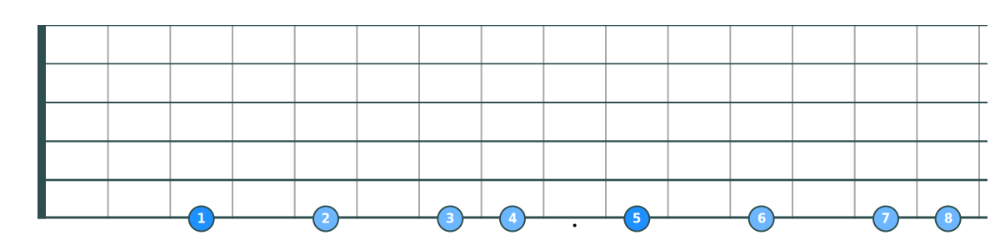
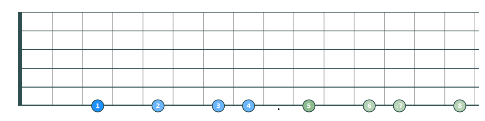
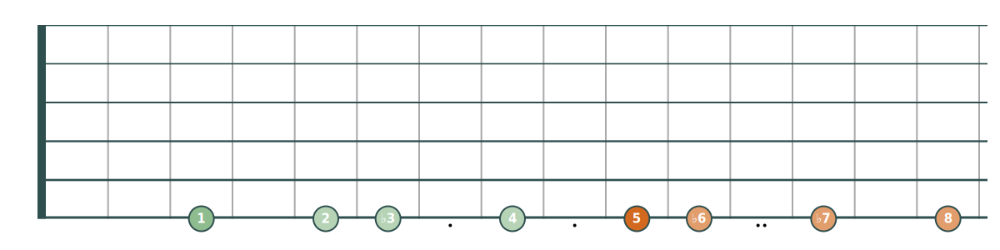
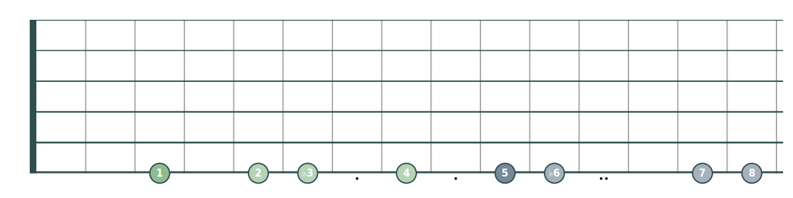
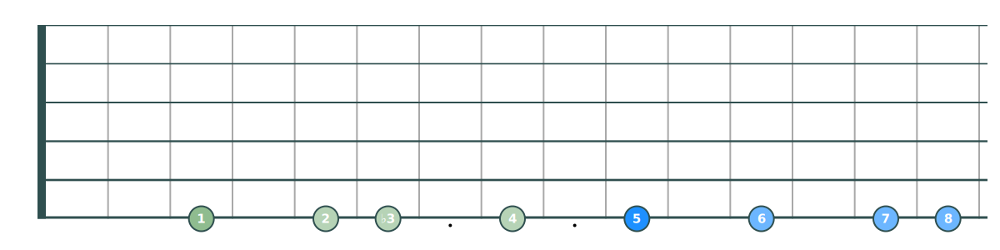
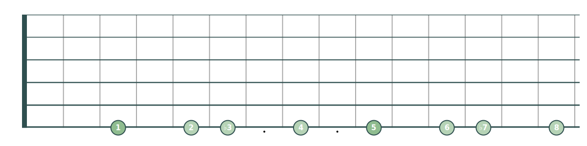
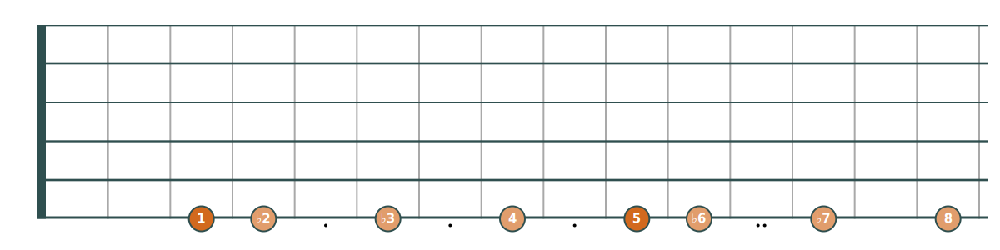
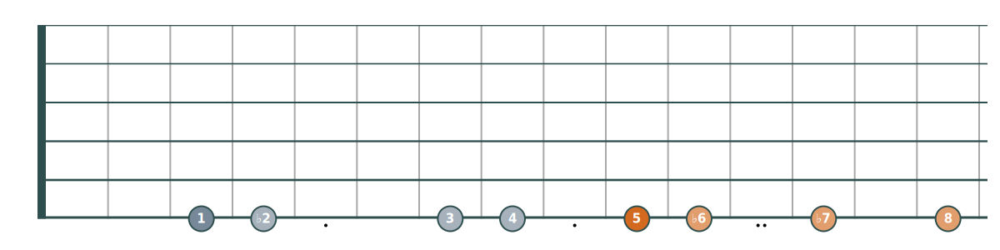
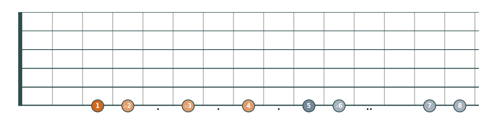
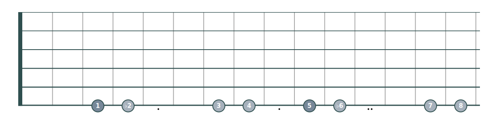

# Single-string scales

## Major

## Mixolydian

## Natural minor

## Harmonic minor

## Melodic minor

## Dorian

## Phrygian

## Phrygian dominant

## Neapolitan minor

## Double harmonic

